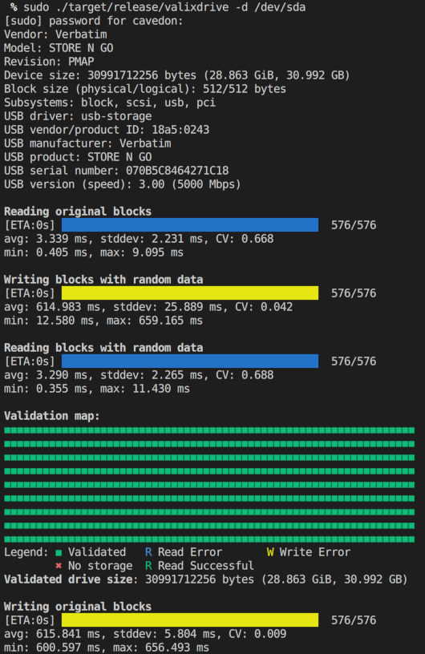

# valixdrive
Tool to validate the actual size of drive (against the drive's declared size).

This tool is:
* An implementation of the concepts from Steve Gibson's
  [ValiDrive](https://www.grc.com/validrive.htm).
* Command-line based
* Implemented for Linux (although support can be added for other OSes).

The motivations for creating this tool were:
* The original [ValiDrive](https://www.grc.com/validrive.htm) is a Windows-only
  tool.
* It seemed like a good project for me to learn Rust.

## How it works

This tool will:
1. Subdivide the drive in 576 (configurable) areas, and select a 4 KiB
   (configurable) block for testing at the end of each area.
2. Read the content of those blocks and save it (so that it can be restored at
   the end of the test).
3. Overwrite those blocks in a random order with random data.
4. Read back the blocks and compare the content with what was written.
5. If the content matches, mark the block as "Validated". If the content does
   not match, mark the block as "No storage".
6. Print a map of the validation of each block, along with the validated drive
   size (i.e. the highest validate block not preceded by not validated blocks).
6. Write back the original block content.

## Screenshot



## Usage

1. Ensure you have the [Rust compiler installed](https://www.rust-lang.org/tools/install).
2. Build valixdrive with `cargo build -r`.
3. Execute `./target/release/valixdrive`.

```
Usage: valixdrive [OPTIONS] --drive <DRIVE>

Options:
  -d, --drive <DRIVE>                  The storage device to test
  -b, --block-size-kb <BLOCK_SIZE_KB>  The block size to read/write in KiB [default: 4]
  -n, --num-blocks <NUM_BLOCKS>        The number of blocks to test [default: 576]
  -R, --read-only                      Perform only a read test
  -w, --map-width <MAP_WIDTH>          Width in columns of the validation map printed on the terminal [default: 64]
  -O, --no-restore-original            Do not read and restore original blocks values
  -h, --help                           Print help
  -V, --version                        Print version
```

## Notes

* This tools access the drive with O_DIRECT and O_SYNC, which is supposed to bypass and OS cache
  and ensure data is read/written directly from/to the drive. However the device may have some
  write cache in the drive. If the drive cache is more than the data written to the device
  (`num-blocks * block-size`, which defaults to 2.25 MiB), the drive may fool this tool. If a large
  hardware cache is suspected, the number of blocks written and/or the block size should be
  increased.
* If you get the error `Device or resource busy (os error 16)`, it is likely your OS auto-mounted a
  partition from the USB drive and you need to unmount it, before you can use this tool.

## Future improvements

* Add unit test coverage.
* Setup a Github test & build pipeline.
* Save the original block content to persistent storage, so that it can be used to recover the
  content of the drive in case of interruption or crash.
* In alternative to writing the original block content back, support for writing zeros or issuing
  TRIM/DISCARD commands for the whole device.
* Automatically un-mount partitions before opening the drive.
* Detect hardware drive write cache presence and size.

## License

MIT License

Copyright (c) 2024 Ludovico Cavedon <ludovico.cavedon@gmail.com>

See [LICENSE](LICENSE).
